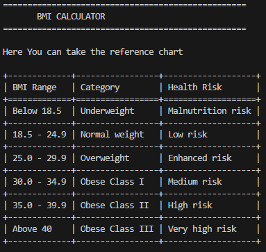

# BMI Calculator

A simple command-line Body Mass Index (BMI) calculator built in Python that helps users assess their weight category and associated health risks.

## Overview

This BMI Calculator allows users to input their height (in meters) and weight (in kilograms) to calculate their BMI and receive an interpretation based on WHO health classifications. The program displays a reference chart with BMI ranges, categories, and health risk levels before performing calculations.

## Features

- **Reference Chart Display**: Shows comprehensive BMI classification table before calculation
- **Accurate BMI Calculation**: Uses the standard formula (weight/height²)
- **Health Risk Classification**: Categorizes results into 6 levels (Underweight, Normal, Overweight, Obese Class I/II/III)
- **Input Validation**: Handles invalid inputs and prevents calculation errors
- **User-Friendly Interface**: Clean terminal output with formatted tables and separators
- **Error Handling**: Manages non-numeric inputs and invalid height values

## Technologies/Tools Used

- **Python 3.x**: Core programming language
- **Built-in Libraries**: No external dependencies required
  - Standard input/output functions
  - String formatting methods

## Installation & Setup

### Prerequisites
- Python 3.6 or higher installed on your system

### Steps to Install

1. **Save the code**: Copy the BMI calculator code and save it as `bmi_calculator.py`

2. **Verify Python installation**:
   ```bash
   python --version
   ```
   or
   ```bash
   python3 --version
   ```

3. **Navigate to the project directory**:
   ```bash
   cd path/to/your/project
   ```

### Running the Project

Execute the program using Python:

```bash
python bmi_calculator.py
```

or

```bash
python3 bmi_calculator.py
```

## How to Use

1. Run the program
2. Review the reference chart displaying BMI categories
3. Enter your height in meters when prompted (e.g., 1.75)
4. Enter your weight in kilograms when prompted (e.g., 70)
5. View your BMI result and health category

**Example:**
```
Enter your height in meters: 1.75
Enter your weight in kilograms: 70

==================================================
Your BMI is 22.86, you have a normal weight.
==================================================
```

## Testing Instructions

### Manual Testing

**Test Case 1: Normal Weight**
- Input: Height = 1.75m, Weight = 70kg
- Expected Output: BMI ≈ 22.86, "normal weight"

**Test Case 2: Underweight**
- Input: Height = 1.70m, Weight = 50kg
- Expected Output: BMI ≈ 17.30, "underweight"

**Test Case 3: Overweight**
- Input: Height = 1.65m, Weight = 75kg
- Expected Output: BMI ≈ 27.55, "overweight"

**Test Case 4: Invalid Input**
- Input: Height = "abc", Weight = 70
- Expected Output: "Invalid input. Please enter numbers only."

**Test Case 5: Zero/Negative Height**
- Input: Height = 0 or negative, Weight = 70
- Expected Output: "Invalid input. Height should be greater than 0."

## Screenshots



## Future Enhancements

- Add imperial units support (feet/inches, pounds)
- Save calculation history to a file
- Create a GUI version using Tkinter
- Add BMI trend tracking over time
- Include personalized health recommendations

